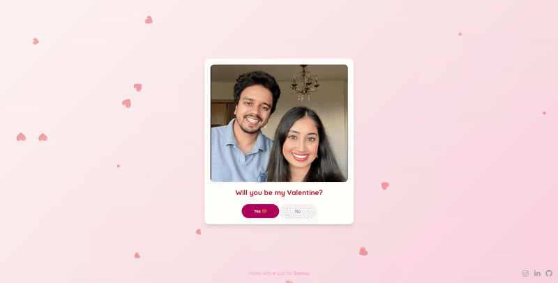

# Forever Valentine: An Interactive Proposal Card

This project is a delightful interactive digital Valentine's card designed to create a memorable proposal experience. Built with React and Tailwind CSS, it features charming animations, a dynamic response system, and a heartfelt message.

## Features

*   **Interactive Proposal:** Users can accept or decline the proposal with engaging animations.
*   **Floating Hearts Animation:** A continuous, subtle animation of floating hearts adds to the romantic ambiance.
*   **Celebration Mode:** A special celebration animation is triggered upon acceptance.
*   **Responsive Design:** Optimized for various screen sizes.

## Run Locally

**Prerequisites:**  Node.js (LTS recommended)

1.  **Clone the repository:**
    `git clone https://github.com/rajhaq/valentine-proposal-card.git`
    `cd valentine-proposal-card`
2.  **Install dependencies:**
    `npm install`
3.  **Run the app:**
    `npm run dev`

The application will be accessible at `http://localhost:3000` (or another port if 3000 is in use).

## Social Media

Connect with the creator and see more projects:

*   **Instagram:** [lifewithzubaer](https://www.instagram.com/lifewithzubaer/)
*   **LinkedIn:** [zubaerhaque](https://www.linkedin.com/in/zubaerhaque/)
*   **GitHub (Project Source):** [valentine-proposal-card](https://github.com/rajhaq/valentine-proposal-card)

## Customization

Feel free to fork this repository and customize the messages, animations, or integrate new features to make your own unique proposal card!

## Credits

Made with ♥ by **Zubaer Haque**